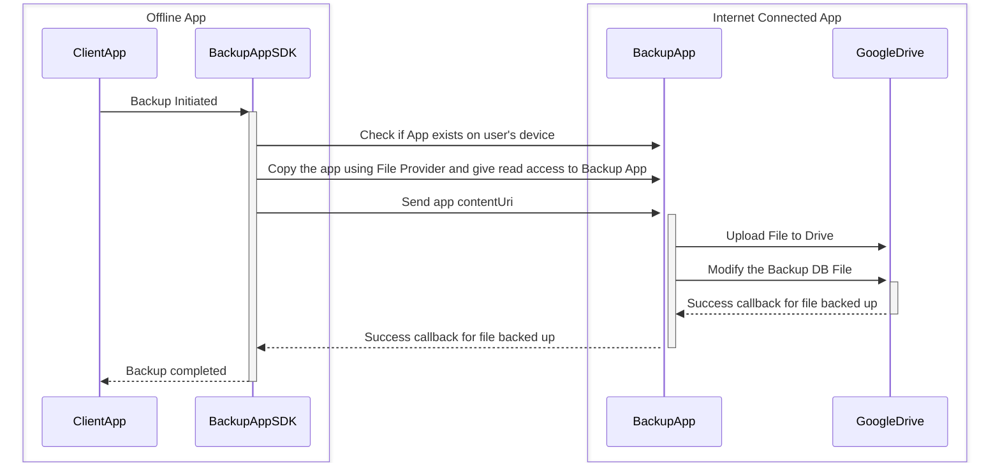

# Comrade 🤝




## How to Use (Not yet Live)
Implement the Comrade SDK in your app and call the backup method.

```groovy
implementation "com.yogeshpaliyal:comrade-sdk:0.0.1"
```

Initialize the Comrade

```kotlin
val comrade = Comrade(context, listener)
comrade.backup(fileToBackup)
```


## Discussion Thread
- https://bsky.app/profile/yogeshpaliyal.com/post/3levtmlemc22g
- https://www.reddit.com/r/androiddev/s/LYNsyXnrdI
